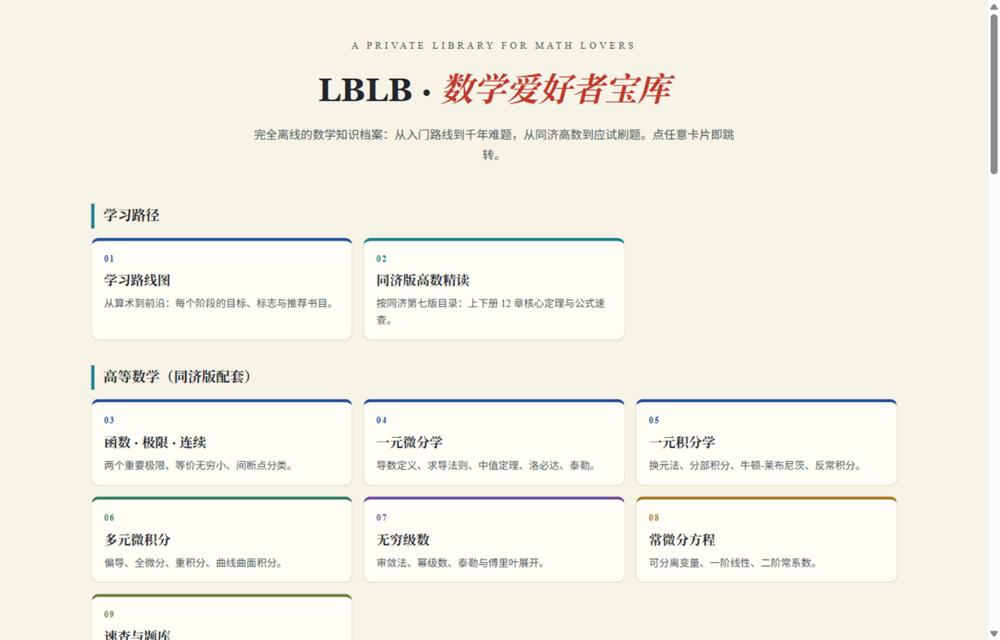
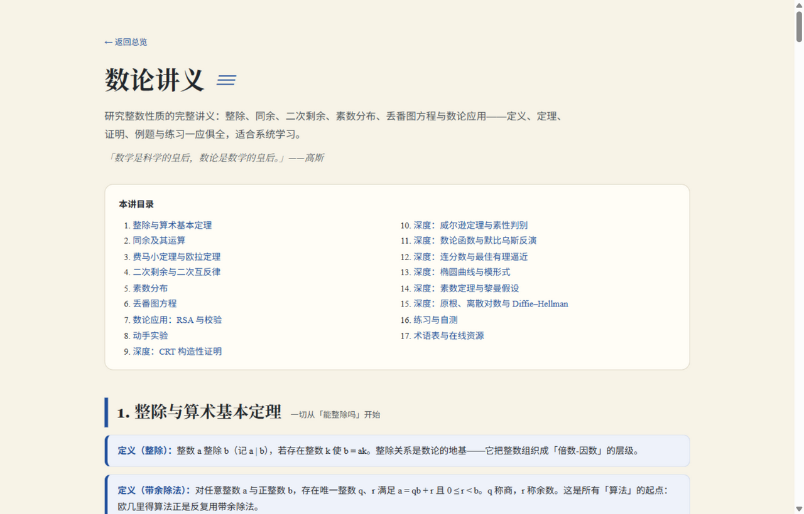
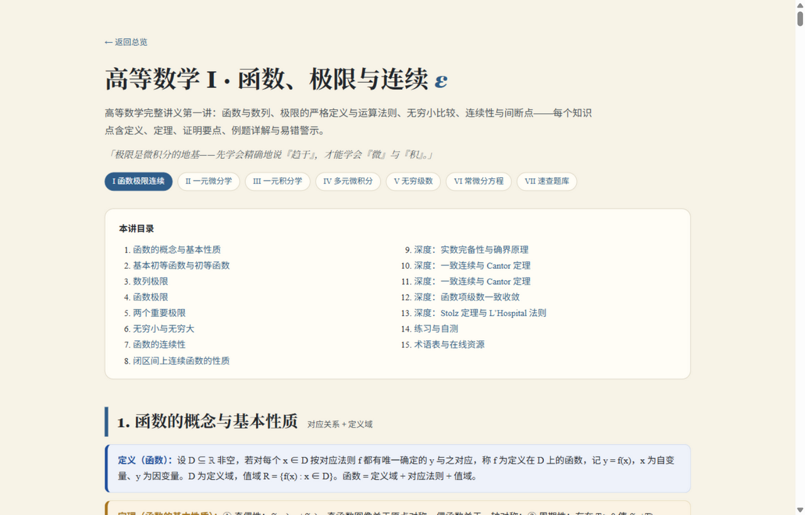
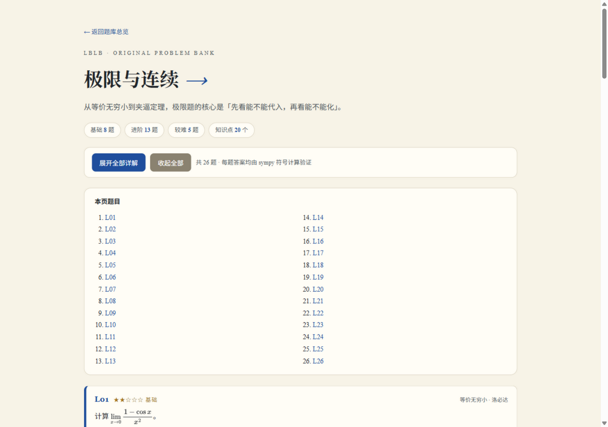

# LBLB · 数学爱好者宝库

一个**纯静态、完全离线**的数学学习资料库：从入门路线到千年难题，从同济高数讲义到交互式数学可视化。全部内容为手写 HTML，不依赖构建工具、不依赖 CDN，克隆下来双击任意页面即可阅读。

[](#技术说明)
[](#技术说明)
[](#内容一览)
[](#题库)



---

## 内容一览

仓库分为 16 个分区，共 97 个 HTML 页面。

| 目录 | 内容 | 页面 |
| --- | --- | --- |
| `00-总览` | 分区导航首页，所有内容的统一入口 | 1 |
| `01-学习路线` | 从算术到前沿的分阶段学习路线图：各阶段目标、标志与推荐书目 | 1 |
| `02-核心主题` | 12 个数学分支讲义：数论、几何、代数、分析、概率与统计、组合与图论、线性代数、拓扑学、复分析、微分方程、博弈论、数理逻辑与集合论 | 12 |
| `03-经典难题` | 经典难题与猜想（费马大定理、黎曼猜想、P vs NP 等），含 arXiv 论文自动更新器 | 1 |
| `04-美丽证明` | 美丽证明集锦、证明的意外连接 | 2 |
| `05-可视化` | 36 个可交互可视化 + 导航页：曼德博集合、洛伦兹吸引子、傅里叶级数、生命游戏、彭罗斯铺砌…… | 37 |
| `06-书单` | 三档书单与学习资源 | 1 |
| `07-趣味数学` | 游戏与策略、魔术与速算、谜题与悖论 | 3 |
| `08-数学史` | 数学史时间线：三千年演进 | 1 |
| `09-前沿动态` | 数学前沿综述、arXiv 论文日报（含更新器与 GitHub Action 定时刷新） | 2 |
| `10-数学手册` | 公式速查、常数与工具台 | 2 |
| `11-数学家` | 数学群星谱、数学家的故事、当代华人数学家 | 3 |
| `12-高等数学` | 同济版《高等数学》配套精读：函数极限、一元微分、一元积分、多元微积分、无穷级数、常微分方程、速查与题库 | 8 |
| `13-应试训练` | 真题刷题与组卷系统（真题与试卷**默认不发布**，权利归属见该区文档） | 7 |
| `14-自测题库` | 9 个主题共 **234 道原创题**，按知识分支组织 | 10 |
| `15-应试实战` | 4 套 **68 道题**，按目标考试（考研数一/数二、专升本、竞赛）对标难度 | 5 |

### 预览

| 核心主题讲义 | 交互式可视化 |
| --- | --- |
|  |  |

| 同济版高数配套 | 题库 |
| --- | --- |
|  |  |

---

## 题库

`14-自测题库` 与 `15-应试实战` 共 **302 道题**，答案全部经 sympy 符号计算逐题验证。

**`14-自测题库`（234 题）** 按知识分支组织，9 个主题各 26 题：极限与连续、一元微分学、
一元积分学、无穷级数、常微分方程、多元微积分、线性代数、概率与统计、数论与组合。

**`15-应试实战`（68 题）** 按目标考试分册，题型分布与难度按对应考试的实际情况编排：

| 分册 | 题量 | 对标要点 |
| --- | --- | --- |
| 考研数学一 | 20 | 高等数学约占 56%，含多元微积分、曲线曲面积分与级数；证明题集中在中值定理与级数 |
| 考研数学二 | 15 | 不含级数与概率论；高数为主 + 线代，计算量大 |
| 专升本 | 18 | 覆盖面广、计算为主、证明较少，难度对标期末偏易到中档 |
| 大学生数学竞赛 | 15 | 靠巧劲：换元、对称性、夹逼、构造；证明题比重高 |

> **这些题对标真实考试，但不是历年真题。** 真题原卷的版权属于各命题单位，不能随公开仓库分发。
> 这里给出的是按考纲范围、题型分布与难度梯度**重新编写**的题目——数学内容本身不受版权保护。
> 真要练原卷，请用 `13-应试训练` 的框架接入你自备的题库。

### 答案是怎么验证的

题目以 Python 数据写在 `tools/bank/` 下，每道题带一个 sympy 断言；`tools/verify_bank.py`
逐题求值，只有全部通过的题目才会被生成到页面上。验证表达式也印在每题详解下方，可自行复核：

```bash
python tools/verify_bank.py     # 逐题验证 302 道题（每题带超时保护）
python tools/build_bank.py      # 验证通过后重新生成页面，不通过则中止
```

这样做的原因很直接：题是自己编的，答案就可能编错。把答案交给符号计算判定，
是让「答案正确」这件事可核查、而不是靠作者自信的唯一办法。

验证器做了几件事来保证判定可靠：多种化简策略（普通化简、展开、三角化简、化为指数形式）、
级数敛散用 `is_convergent()`（比 `doit()` 更可靠）、含参幂级数在收敛域内取点比较、
以及**单题超时**——有些符号积分会让 sympy 长时间不返回，没有超时的话一道题就能把整条
流水线挂死，所以每个 bank 文件在独立子进程里跑并设硬超时。

另外还有一条**一致性检查**：若断言判定某极限为无穷/发散，而手写的答案却给了一个有限值，
校验会直接报错。这条规则是为了抓「断言和答案各写一套」这类人为失误。

---

## 语言

站点**只有中文**，不带语言切换。早期版本曾内置一套双语系统（`assets/i18n.js` +
`data-i18n` 词条 + `data-lang` 区块），后来去掉了：数学内容的错译比不译更有害，
而逐页人工翻译的成本远高于它的收益。需要双语时，请在你自己的分支上加回来。

题库里的英文题干（`q_en` 等字段）仍保留在 `tools/bank/` 数据源里，但页面不再输出英文区块；
若要重新启用，生成器（`tools/build_bank.py`）需要相应改回并列渲染。


---

## 重要：哪些内容没有包含在仓库里

为保证仓库可以合法公开，**13-应试训练** 分区只包含页面框架与工具代码，**不包含任何真题、模拟题和试题图片**。

原始本地库中曾收录的以下内容因版权属于各命题单位、出版社或原整理者，**未**进入本仓库：

- 各类考试真题与模拟卷 PDF（专升本、考研、CMC、校级期末等）；
- 由 PDF 转录而来的题库 JS 数据文件；
- 试题扫描图与题图。

因此，直接打开 `13-应试训练/05-真题模拟卷.html`、`06-真实单题训练.html`、`07-题库覆盖与来源.html` 时会看到一条提示，说明数据文件缺失及如何自行提供。**这些页面在没有数据时不会报错，只是显示为空。**

如需使用该分区，请自备已获授权的题库数据；数据文件的字段格式见 [`13-应试训练/README.md`](13-应试训练/README.md)。

同理，`09-前沿动态/论文数据.js` 与 `03-经典难题/经典难题数据.js` 均为**可公开再分发**的元数据（论文标题/链接/状态描述），随仓库提供。

---

## 快速开始

### 方式一：本地打开（推荐）

```bash
git clone <你的仓库地址>.git
cd <仓库名>
```

然后双击根目录的 `index.html`，或直接双击任意分区中的 HTML 文件。全部功能（含公式渲染）在离线状态下均可用。

> 若你的浏览器对 `file://` 协议限制较严（个别页面会用到 `fetch`），可在仓库根目录起一个静态服务：
> ```bash
> python -m http.server 8000
> ```
> 再访问 `http://127.0.0.1:8000/`。

### 方式二：GitHub Pages 在线浏览

1. 打开仓库 **Settings → Pages**；
2. Source 选择 **Deploy from a branch**，分支选 `main`、目录选 `/ (root)`，保存；
3. 稍等片刻，访问 `https://<用户名>.github.io/<仓库名>/`。

页面中的中文文件名在 URL 中会被自动编码，不影响访问。仓库根目录已包含 `.nojekyll`，避免 Jekyll 忽略以下划线开头的文件。

---

## 技术说明

- **零构建**：没有打包器、没有 `node_modules`、没有编译步骤。所有讲义和可视化都是单文件 HTML（CSS/JS 内联），改完刷新即可生效。
- **完全离线**：公式渲染由仓库内自带的 MathJax 完成（`assets/`），页面不从任何 CDN 拉取资源；数学字体随仓库分发。
- **无追踪**：不含分析脚本、不含第三方请求。CSP 元标签限制了可加载的资源来源。
- **响应式**：页面在桌面与移动端均可阅读，可视化画布自适应窗口宽度。

### 目录约定

```
<仓库根>/
├── index.html            # 入口落地页
├── 00-总览/ … 12-高等数学/   # 内容分区，每个内含若干独立 HTML
├── 13-应试训练/           # 刷题框架（不含题库数据）
│   └── 123/
│       ├── 代码/          # 审计与构建脚本
│       └── 试卷清单.js     # 试卷元数据索引（可选）
├── 14-自测题库/           # 234 道原创题（由 tools/build_bank.py 生成，勿手改页面）
├── assets/              # MathJax（第三方，Apache-2.0）
├── tools/               # 全站工具：审计、题库验证/生成、可视化导航生成
│   └── bank/            # 题库数据源（每题带 sympy 验证断言）
└── docs/                # 项目文档与预览图
```

各分区页面的 MathJax 引用使用相对路径（`../assets/...`），因此**移动文件时请保持目录层级不变**，否则公式将无法渲染。

`assets/mathjax/es5/` 下的目录树必须**整份保留**（`tex-svg.js` 之外还有 `input/tex/extensions/`、`input/mml/`、
`adaptors/` 等按需加载的模块）。只拷贝那个主文件会导致一个很隐蔽的故障：页面用到 `\boldsymbol`
之类的命令时 MathJax 会去取对应的扩展文件，取不到就整页公式**一个都不渲染**（正文原样显示 `$...$`）。
要瘦身请只删 `es5/output/chtml/fonts/`（CHTML 输出用不到），不要删 `es5/input/`。

---

## 维护工具

`tools/` 下是面向全仓库的脚本（Python 标准库 + sympy）：

| 脚本 | 作用 |
| --- | --- |
| `audit_pages.py` | 全站静态体检：结构缺陷、公式定界符、章节编号乱序、内部链接失效、疑似未用 LaTeX 的数学记号 |
| `verify_bank.py` | 逐题验证 `tools/bank/` 里 302 道原创题的 sympy 断言 |
| `build_bank.py` | 验证通过后生成 `14-自测题库/` 页面（不通过则中止，不会写入未验证的答案） |
| `build_viz_nav.py` | 生成 `05-可视化/可视化导航.html`，并校验 36 个可视化模块的链接完整性 |
| `fix_plaintext_math.py` | 把正文里的纯文本数学记号（`e^(iπ)`、`∫_0^1`）转成 LaTeX；默认干跑，需 `--apply` 才写入 |
| `fix_math_lt.py` | 把页面公式里未转义的 `<`（`$P(a<X<b)$`）改成 `&lt;`：浏览器会把它当标签吃掉，导致整条公式变成原样文字；默认干跑，需 `--fix` 才写入 |
| `fix_data_lt.py` | 同一类问题，但作用于题库数据源（`tools/bank/`、`13-应试训练/123/` 下的 `.py`/`.js`）；这类文件是运行时注入 HTML，所以同样要转义 |
| `bank_kit.py` | 题库数据结构与 sympy 化简/断言语义（`zero`、`eq`、`approx`、`diverges`、`eq_in` 等） |

```bash
python tools/verify_bank.py                 # 验证题库
python tools/audit_pages.py                 # 全站审计
python tools/audit_pages.py --only structure # 只看结构类问题
```

审计与转换脚本都按仓库相对位置定位文件，克隆到任意路径都能直接运行。

### 前沿论文更新器

`09-前沿动态/数学前沿更新器.py` 会从 arXiv（不可达时自动切换到 Semantic Scholar）抓取 12 个数学分支的最新论文，生成 `论文日报.html` 与 `论文数据.js`，供 `02-核心主题` 各分支页面的「最新研究」区块直接加载。

```bash
python 09-前沿动态/数学前沿更新器.py          # 联网更新
python 09-前沿动态/数学前沿更新器.py --demo   # 离线演示，用内置示例数据生成页面
```

仅使用 Python 标准库，无需安装依赖。Windows 下也可双击 `09-前沿动态/打开数学前沿并更新.bat`。

更新器会把上游元数据清洗后再写进页面，包括：把 LaTeX 重音转义还原成 Unicode（`Corti\~nas` → `Cortiñas`）、
截断时保证 `$` 成对（否则未闭合的 `$` 会让 MathJax 吞掉后续正文）、补上 arXiv 常用自定义宏，
以及**剔除混进标题/摘要字段的 LaTeX 导言区**（上游数据里真的会出现
`\documentclass...\begin{document}`，不清掉会让页面报 `Unknown environment 'document'`）。

### 经典难题更新器

`03-经典难题/经典难题更新器.py` 为每个猜想条目从 arXiv 抓取最近论文，追加到 `关键论文` 列表。状态判定（未解决／部分解决／已解决）由人工维护，脚本不会自动改判。

```bash
python 03-经典难题/经典难题更新器.py            # 联网更新
python 03-经典难题/经典难题更新器.py --demo     # 仅刷新时间戳，不联网
```

### 页面与公式审计脚本

`13-应试训练/123/代码/` 下有四个脚本，用于批量检查页面质量：

| 脚本 | 作用 |
| --- | --- |
| `scan_deep.py` | 检查 `$` 配对、裸露的导数记号与 `^` 指数（应为 LaTeX） |
| `scan_formulas.py` | 检查公式定界符与转义 |
| `scan_js.py` | 检查题库 JS 中 `$...$` 之外出现的裸数学符号 |
| `build_unified.js` | 汇总题库源，去重后生成统一题库（需自备数据） |

前三个为纯 Python 标准库脚本，可脱离题库数据在页面文件上直接运行。`scan_js.py` 与 `build_unified.js` 针对题库数据文件，缺少数据时会报告 `[MISS]` 并跳过。

---

## 授权与第三方

本项目采用**分项授权**：

- **文字内容与图片**（各分区 `*.html` 中的讲义、题解、图表）：[CC BY-NC-SA 4.0](https://creativecommons.org/licenses/by-nc-sa/4.0/deed.zh) —— 署名、非商业性使用、相同方式共享。
- **代码**（`*.py` 更新器与审计脚本、`*.js` 工具、页面中的交互逻辑）：[MIT](LICENSE-MIT)。

第三方组件与未收录内容的说明见 [`THIRD-PARTY-NOTICES.md`](THIRD-PARTY-NOTICES.md)。

> 仓库内数学内容为学习整理，力求准确但**不保证无误**；发现错误欢迎提 Issue。
